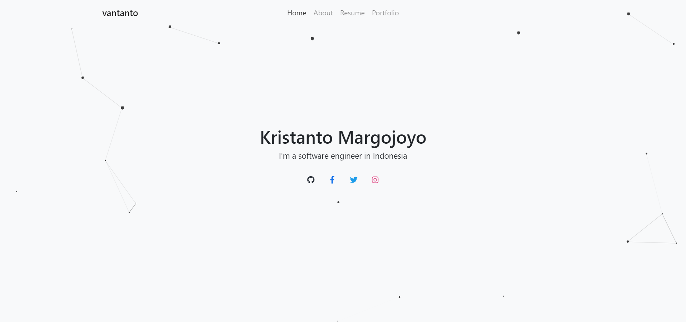

<h1 align="center">
  VanTanto
   
</h1>

<h4 align="center">A minimal portfolio for <a href="https://vantanto.github.io" target="_blank">GitHub Pages</a>.</h4>

> **Note**
> Single Page Application (SPA) portfolio build with Tubolinks.

## 📸 Showcase

 
<strong><a href="https://vantanto.github.io" target=_blank>visit website</a></strong>

## 📝 Credit

#### Special Thanks
- [Bootstrap](https://https://getbootstrap.com//)
- [particle.js](https://vincentgarreau.com/particles.js/)
- [Turbolinks](https://github.com/turbolinks/turbolinks)

This project is [MIT](https://github.com/vantanto/vantanto.github.io/blob/master/LICENSE) licensed.
